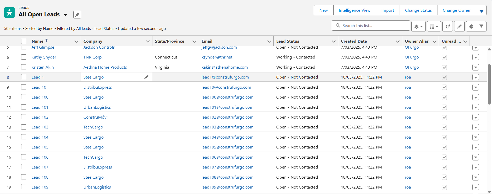

# Documentación Técnica de Salesforce - ConstruFurgo

## Introducción

Se debe crear una organización de salesforce para la empresa construfurgo, entonces se creo una con las siguientes credenciales: 

- Dirección de la organización: https://orgfarm-7f237ed705-dev-ed.develop.my.salesforce.com/
- Nombre de usuario: roajhon98213@agentforce.com
- Contraseña: 33102108A

## Configuración General

### Información general

Se solicito ingresar la siguiente información:

| Razón social                              | ConstruFurgo S.A.S.                                          |
| ----------------------------------------- | ------------------------------------------------------------ |
| Número de Identificación Tributaria (NIT) | 901456789-2                                                  |
| Domicilio Principal                       | Av. Boyacá #12-33, Bogotá, Colombia.                         |
| Capital Social                            | $5,000,000 USD                                               |
| Tipo de Empresa                           | Sociedad por Acciones Simplificada (S.A.S.)                  |
| Objeto Social                             | Diseño, fabricación, comercialización y mantenimiento de furgones industriales. |
| Representante Legal                       | Juan Pérez López                                             |
| Registro Mercantil                        | Matrícula 456789 en la Cámara de Comercio de Bogotá.         |
| Correo Oficia                             | contacto@construfurgo.com                                    |

Los datos anteriores fueron agregados en sus campos correspondientes en company information:

- Se cambio la configuración de ubicación de la compañía ya que debido a la dirección esta se encuentra en Colombia.
- Los datos que no fue posible añadir en company information se añadieron en custom settings
- Me hubiera gustado agregar como campo lookup a contacto el representante legal, pero no era posible

### Jerarquía de roles y permisos

Se creo la jerarquía de roles y servicios como se pedía en los requerimientos y se borro la que estaba configurada de manera predeterminada:

### Creación de permisos

Para la creación de permisos se creara una combinación entre profiles y permission sets, creando permisos de forma modular que se puedan usar en varios usuarios. se necesitan crear dos perfiles, debido a que soporte técnico sera asignado a salesforce administrator (nosotros), el role de CEO tiene permiso sobre todos los usuarios, por ende solo quedaría dos profiles por crear (SalesManager, ProcurumentSpecialist). Finalmente el profile correspondiente al gerente de producción no es necesario debido a que debido a los cambios realizados este rol fue eliminado.

#### Creación de permission sets:

**ver y editar productos productos:** 

**Manejo de proveedores:** Hay un objecto llamado seller en salesforce el cual se encuentra conectado a productos y sera el que usaremos para la gestion de proveedores

**Manejo de oportunidades:** 
    

**Manejo de oportunidades:** El objeto estandar **Orders** sera utilizado para el manejo de ordenes    

**Manejo de leads:** 

**Manejo de Accounts:** Se otorga acesso al objeto de accounts ya que estos son los clientes junto a contacts

    

**Manejo de contactos:** 

**Visibilidad y creación de reportes:** Esto es algo que va a ser necesario en varios de los profiles que vamos a crear, por ende voy a crear un permission set que sera asignado a todos 

**Uso de knowledge:** Debido a que en la aplicacion de salesforce para los usuarios dedicados al soporten(nosotros) y el ceo se creo este permission set

**Visibilidad de casos:**

#### Creacion de permission set groups:

Una vez configurado inicialmente los permission sets estos se asignan a permission set groups los cuales van a corresponder a un rol en el trabajo, cabe destacar que **esta forma de realizar el acceso a permisos fue sacado de lo aprendido en la documentación de SalesForce.**

- Al crear un permission set group podemos silenciar ciertos permisos de los permission sets que no nos interese que tenga el permission set group (los permisos en salesforce funcionan de tal manera que el mas permisivo es el que manda, por ende si este permiso se encuentra en el perfil o en otro grupo este no sera visible)

**Gerente de ventas:** Este profile se creara segun las necesides encontradas al momento de plantear el proyecto. Las cuales son las siguientes:

- Administración de clientes, oportunidades de negocio y crecimiento del mercado. 

**Gerente de Compras:**

- Manejo de proveedores y optimización de entregas.

**TechnicalSupport** 

- Se creo el perfil de technical support para hacer su asignacion posible al CEO

#### Creación de profiles:

Debido a que la version developer de SalesForce tiene un limite de 4 licencias SalesForce, el usuario encargado es el mismo SystemAdministrator (nosotros), por ende se crearan 3 profiles: ConstruFurgo - CEO, SalesManager y ProcurementSpecialist.

- A los perfiles en SalesForce es recomendable darles el minimo acceso clonando el perfil de MinimunAcess y a través de este asignarle permission sets y permission set groups.

**Construfurgo - CEO:** Originalmente pensaba dejar a este usuario con el rol de SystemAdministrator, pero tome la decision de crearle un rol que le diera acceso principalmente a todas las aplicaciones de ConstruFurgo.

A traves de el perfil de CEO se le dio acceso al usuario a la modificacion y visualizacion de reportes y dashboards

**SalesManager**:  Se le dio al usuario acceso a los dashboards, como parte de los requerimientos

**ProcurementSpecialist:**

### Creación de usuarios

Los usuarios fueron tomados de el csv users.csv de los archivos que fueron asignados.

#### CEO:

**Usuario:** carlosperez@construfurgo.tv

**Contraseña:** 9MVeLqWF

#### SalesManager:

**Usuario:** maría.gómez@construfurgo.tv

**Contraseña:** MIoxHcy3

#### ProcurementSpecialist.

**Usuario:** anamartinez@construfurgo.tv	

**Contraseña:** hKnP3ZGA

### Asignacion de permission set groups a usuarios:

Asignamos estos a sus usuarios correspondientes, que en estos casos serian el gerente de ventas y el gerente de compras y al ceo le damos los dos permission sets para que tengan acesso a lo que pueden hacer los usuarios

- Para agregar usuarios a un permission set group es posible filtrarlos, pero en este caso la muestra es pequeñá, por ende no fue necesario

### Creación de Aplicaciones 

Al momento de crear las aplicaciones se tuvo en cuenta el hecho de que hay un espacio maximo de 5MB en la organizacion, por ente por prevenir futuras limitaciones en el espacio no se coloco ninguna imagen.

#### Aplicación de Ventas (Usuarios: CEO, Gerente de Ventas,Gerente de Compras)

- Gestión centralizada de oportunidades y leads.
- Gestión de compradores y órdenes de compra.
- Dashboard interactivo con cotizaciones enviadas y pendientes.
- Registro de actividad comercial y reuniones con clientes.

#### Aplicación de Soporte (Usuarios: CEO, Gerente de Soporte)

- Registro automático de tickets de servicio al cliente.
- Base de conocimientos con soluciones a problemas frecuentes.
- Panel de métricas sobre cantidad de casos abiertos y la resolución del mismo.

Al momento de crear la pagina para cumplir con las condiciones 2 y 3 se realizo lo siguiente, se habilito knowledge de salesforce y se creo una lightning page para cumplir con la condición 3

## Creación de objetos, campos y datos

- Considero que para la configuración de esta organización, la gran mayoría de objetos estándar de SalesForce es suficiente, por ello para campos como lo es el id presente en los csv solo sera un campo nuevo a añadir
- Como fue dicho propiamente antes, se crearan campos del tipo external id para hacer match en los datos

#### **¿Por que usar objetos personalizados?**

La principal y mayor razón por la que no se usaron objetos personalizados es que muchos de los objetos estándar de salesforce tienen funcionalidades que no se pueden duplicar en objetos personalizados

### Importación de datos

Para la importación de datos considere que la herramienta mas conveniente era el data loader debido a que estamos importando a objetos estandar

#### Importación de datos en Accounts

#### Importación de datos en Contacts
Se importaron 800 registros en contacts, debido a la posibilidad de quedarse sin almacenamiento, los siguientes datos seran truncados a maximo 200

#### Importación de datos en Leads
En la importacion de leads se añádio company name ya que es un campo necesario al momento de crear un lead, ademas de que se añadieron nombres de las companys que existian en accounts

#### Importación de datos en Cases
Al momento de importar datos a cases se tomaron las siguientes decisiones 

- cambiar el status de open a new, ya que como tal en los leads no existe ese status y no considere necesario crearlo

- se añadio el valor critical a la picklist de priority

- finalmente el case origin tambien era necesario, por ende se asumio el case origin de todos como phone

- A pesar de cambiar el estado a new, este se considera abierto, ya que esto es otro campo que se activa automaricamente

#### Importación de datos en Opportunities
Se Realizaron los siguientes cambios

- Se añadio una close date debido a que esta era necesaria

- se tradujeron los stages a al ingles para que hicieran match

#### Importación de datos en Products
Se Realizaron los siguientes cambios

- Se añadieron campon no existentes como lo eran price y stock para cumplir las necesidades de la empresa costrufurgo

- Se añadio un record type que añadiera los valores a la picklist product family (category) para que fueran los de los registros existentes

